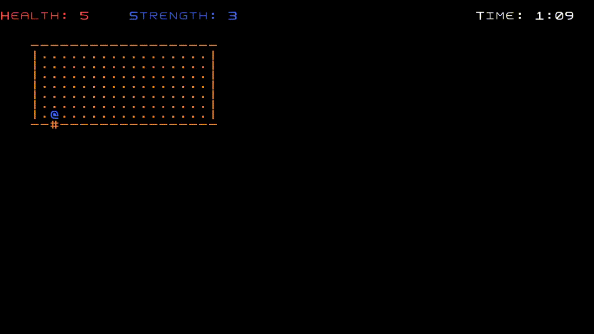
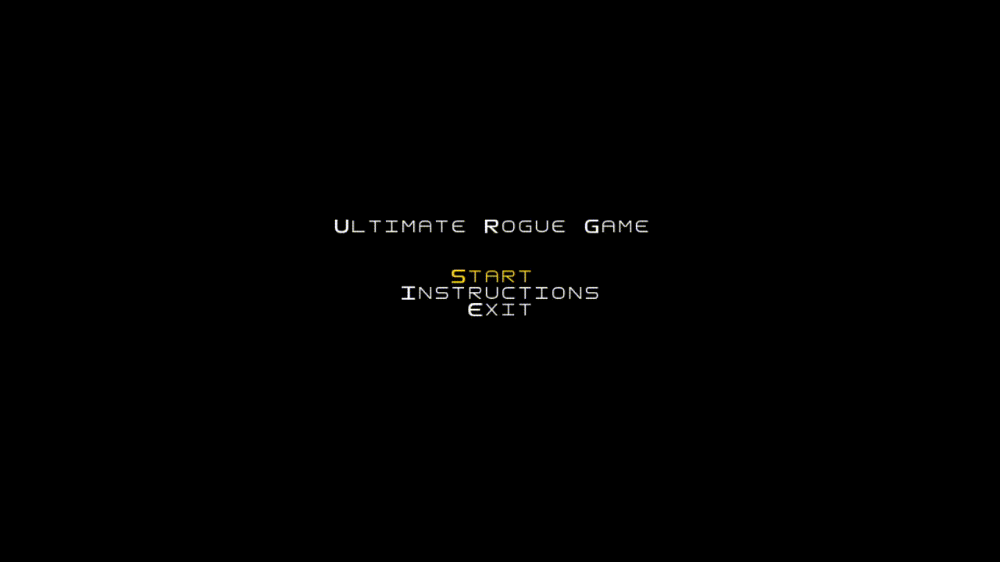
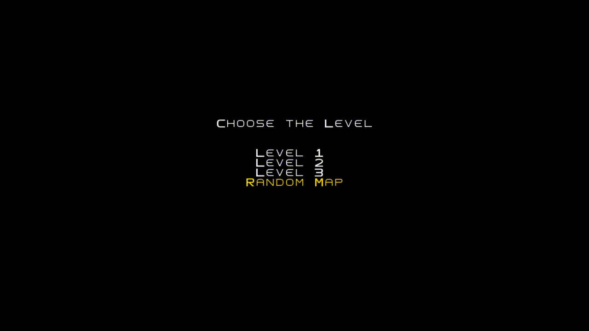
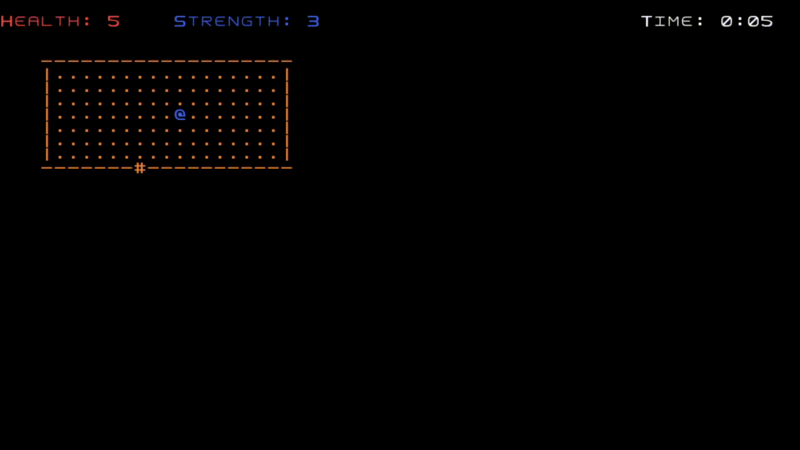

# Ultimate Roguelike Game

This is a game inspired in the original rogue game. It uses the Lanterna library for the graphical interface.
The objective is to control the hero and reach the goal in the map, killing monsters on the way, collecting coins, potions, etc.

## Implemented Features

- Visibilty features: New rooms, and parts of the paths are only revealed when the player approachs it, as well as the content inside the active room.
  
  
- Three standard levels made.
  

- Random map generation.
  

- A random path generator using as a guide the original rogue idea
  

- Coins that regenarate health for the mob that collects it, which can a hero but also a monster.
  

- Potions that increases the strength for the mob that collects it, which can a hero but also a monster. The mob also changes color during the effect of the potion.

- Time limit to complete each level.
  

- Option to pause during the game (pressing ESC).
  

- Combat system for the hero (pressing X to hit the monsters near by). There's also a color animation of the monsters that have been hit.
  

## Design Patterns used

### MVC

The main design pattern used, which defined the structure of the code development, was the MVC (Model-View-Controller).
In the Model package we have the basic attributes and components of the elements being used in the game.
In the View package we have the structures that control the visualization of those elements. And in the Controller package we have the structures to control the actions of the elements and the interactions between them.

### State

Together with the MVC, the state pattern is really important to the structure of the code. It basically uses the proper controller and viewer to represent the game, depending on which game state it is.

#### Game loop 

Implemented in the Game class itself, the other two previous design patterns are used inside a basic game loop pattern, that runs through the whole game. It also has the responsibility for the frames per second of the game. The players input is now get by polling to avoid the halt of the game.

### Factory-Method

The factory method pattern is used for example in the State class (the subclasses have the responsability to which Viewer and Controller to use), the Viewer class (the subclasses have the responsability to implement the drawElements method) and the Controller class (the subclasses have the responsability to implement the step function, to make the actions needed in the game).

## Known Code Smells and Refactoring Suggestions

- Similiar code used inside HeroController and the MonsterController about the retrieving of coins and potions.

- Room class, in the model section, is a large class. It had to be like this, because it is a fundamental structure of the game, and it should store a lot of informations about itself.

- The ocurrence of message chains in some controllers methods. It had to be like this, because of the single-responsibility principle, therefore needing to "make a long chain" to call the right class for doing that.

- Usage of 'instance of' in WallViewer. It had to be that way due to the structure of the Viewer<Wall> interface.

- The classes are well organized with its own responsibilities, but big changes in some fundamental classes (like the models), which a lot of classes depends on, may lead to changes in other classes too.

- RoomViewer has a specific implementation of its drawElements, and it's not so practical for extensions.

## Testing

The code has been well tested, containing 63 tests in total. The tests cover the main functionalities of the code, and with a good independency from other classes, always using mocks and stubs whenever possible.

## Self-evaluation

Victor Saldanha Nunes - 50%
Pedro Rezende Carvalho - 50%

LPOO_T06G65